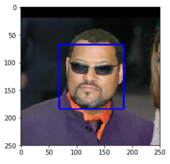
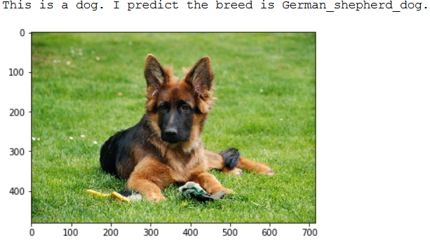
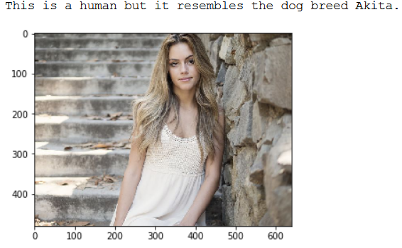

# Data Scientist Nanodegree: Capstone Project


The purpose of this project is to use a convolutional neural network (CNN) to predict dog breeds. The pipeline is the evaluation of an image as a dog or a human, then a prediction of which dog breed the dog is, or which dog breed the human most resembles. 

How I proceeded exactly and what results I achieved can be read in my blog post: (LINK)


## Table of Contents
1. [Introduction](#introduction)
2. [Software Requirements](#software_requirements)
3. [Folder Structure](#folder_structure)
4. [Getting Started](#getting_started)
5. [Running APP](#running_app)
    1. [Detect Humans Face](#detect_humans_face)
    2. [Classify Dog Breeds](#classify_dog_breeds)
6. [Project Results](#project_results)    
7. [Authors](#authors)
8. [Project Motivation](#motivation)
9. [Acknowledgements](#acknowledgement)


<a name="introduction"></a>

## Introduction

In the course of this nanodegree from Udacity, as part of the Capstone project, I created a pipeline that can be used in a web or mobile app to process real images taken by users. Based on a picture of a dog, the algorithm I created can make an assessment about the dog breed. If supplied an image of a human, the code will identify the resembling dog breed.

<a name="software_requirements"></a>

## Software Requirements

Required libraries:

+ Python 3.x
+ Scikit-Learn
+ Keras
+ TensorFlow
+ Numpy
+ Pandas
+ Matplotlib
+ OpenCV

Please run ```pip install -r requirements.txt```


<a name="folder_structure"></a>

## Folder Structure

```
C:.
│   dog_app.ipynb
│   extract_bottleneck_features.py
│   README.md
│   requirements.txt
│
├───bottleneck_features
├───data
│   ├───dog_images
│   └───lfw
├───haarcascades
│       haarcascade_frontalface_alt.xml
│
├───images
│       American_water_spaniel_00648.jpg
│       border_collie.jpg
│       Brittany_02625.jpg
│       Curly-coated_retriever_03896.jpg
│       dog_breed_main_pic.jpg
│       german_shepherd_dog.jpg
│       great_dane.jpg
│       Labrador_retriever_06449.jpg
│       Labrador_retriever_06455.jpg
│       Labrador_retriever_06457.jpg
│       man.jpg
│       sample_cnn.png
│       sample_dog_output.png
│       sample_human_2.png
│       sample_human_output.png
│       Welsh_springer_spaniel_08203.jpg
│       woman1.jpg
│       woman2.jpg
│
└───saved_models
```


<a name="getting_started"></a>

## Getting Started

1. Make sure Python 3 is installed.
2. Clone the repository and navigate to the project's root directory in the terminal
3. Download the [dog dataset](https://s3-us-west-1.amazonaws.com/udacity-aind/dog-project/dogImages.zip). Unzip the folder and place the three files (test, train and valid) in the cloned repository in the folder ```data/dog_images```. If one of these folders does not yet exist, please create it manually. 
4. Download the [human dataset](https://s3-us-west-1.amazonaws.com/udacity-aind/dog-project/lfw.zip). Unzip the folder and place it in the cloned repository in the folder ```data/lfw```. If one of these folders does not yet exist, please create it manually. 
5. Download the VGG-16 and InceptionV3 bottleneck features and place them in the cloned repository in the folder ```bottleneck_features```. If this folder does not yet exist, please create it manually. 
6. Start the notebook ```dog_app.ipynb```.


<a name="running_app"></a>

## Running APP


## Running APP

<a name="detect_humans_face"></a>

### Detect Humans Face

I used OpenCV's implementation of [Haar feature-based cascade classifiers](https://docs.opencv.org/master/d7/d8b/tutorial_py_face_detection.html) to detect human faces in images.




<a name="classify_dog_breeds"></a>

### Classify Dog Breeds

I used transfer learning to create a convolutional neural network (CNN). I used this to determine the breed of dog from dog pictures. 

+ If a dog is recognised in the image supplied, the algorithm returns the corresponding breed:




+ If a human is recognised in the image provided, the algorithm returns the resembling dog breed:




+ If neither a human nor a dog can be seen in the picture, the algorithm returns the following error message: "Error: Please input an image of a human or a dog."

<a name="project_results"></a>

## Project Results

In summary, the CNN model I created with transfer learning far surpassed the CNN created from scratch in terms of performance. 
The accuracy of the InceptionV3-model (pre-trained on ImageNet) reached 68% while the CNN from scratch was about 5%.
The ImageNet dataset contains more than one million training images on which the InceptionV3 model was trained. This results in an extreme increase in performance compared to CNN from scratch. 
The accuracy of 5% could possibly have been increased again if data augmentation had been used in the model training.
When tested on new images, the CNN model with transfer learning performed as I expected, not perfect but good enough. 

<a name="authors"></a>

## Authors

+ [Michael Fuchs](https://github.com/MFuchs1989)

<a name="motivation"></a>

## Project Motivation: 

Udacity has given students the freedom to choose the area in which they would like to complete their capstone project. Possible technical fields would have been:

+ [Robot Motion Planning](https://docs.google.com/document/d/1ZFCH6jS3A5At7_v5IUM5OpAXJYiutFuSIjTzV_E-vdE/pub)
+ [Healthcare](https://docs.google.com/document/d/1WzurKKa9AX2DnOH7KiB38mvozdOSemfkGpex8hdTy8c/pub)
+ [Computer Vision](https://docs.google.com/document/d/1y-XfjkPFgUQxFIQ9bBncUSjs4HOf5E-45FrLYNBsZb4/pub)
+ [Education](https://docs.google.com/document/d/1vjerjRQnWs1kLbZagDYT6rNqiwAG23Yj45oUY88IAxI/pub)
+ [Investment and Trading](https://docs.google.com/document/d/1ycGeb1QYKATG6jvz74SAMqxrlek9Ed4RYrzWNhWS-0Q/pub)

As I am personally very interested in Deep Learning and have already completed my Nanodegree in Computer Vision via Udacity, I found it exciting to complete my capstone project in this area as well. 
So I choose to use Convolutional Neural Networks to Identify Dog Breeds.

<a name="acknowledgement"></a>

## Acknowledgements

I thank [Udacity](https://www.udacity.com/) for providing this challenge and learning experience. 