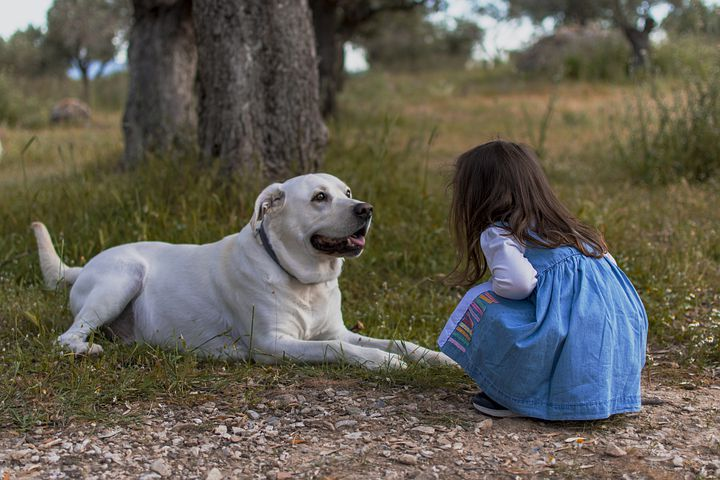

# Data Scientist Nanodegree: Capstone Project

The purpose of this project is to use a convolutional neural network (CNN) to predict dog breeds. The pipeline is the evaluation of an image as a dog or a human, then a prediction of which dog breed the dog is, or which dog breed the human most resembles. 

How I proceeded exactly and what results I achieved can be read in my blog post: (LINK)

## Table of Contents
1. [Introduction](#introduction)
2. [Software Requirements](#software_requirements)
3. [Project Instructions](#project_instructions)

XX. [Authors](#authors)
XX. [Project Motivation](#motivation)
XX. [Acknowledgements](#acknowledgement)

## Introduction

In the course of this nanodegree from Udacity, as part of the Capstone project, I created a pipeline that can be used in a web or mobile app to process real images taken by users. Based on a picture of a dog, the algorithm I created can make an assessment about the dog breed. If supplied an image of a human, the code will identify the resembling dog breed.

## Software Requirements

## Project Instructions

## Authors

+ [Michael Fuchs](https://github.com/MFuchs1989)

## Project Motivation: 

## Acknowledgements

I thank [Udacity](https://www.udacity.com/) for providing this challenge and learning experience. 